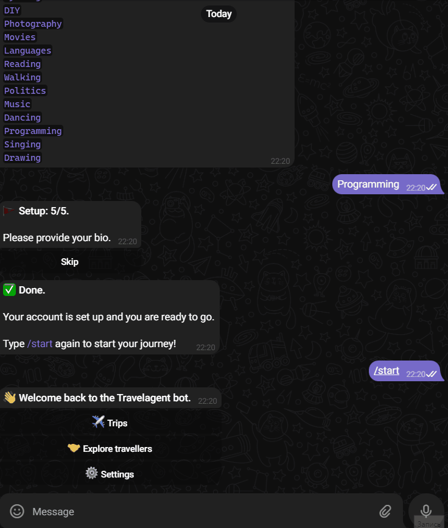
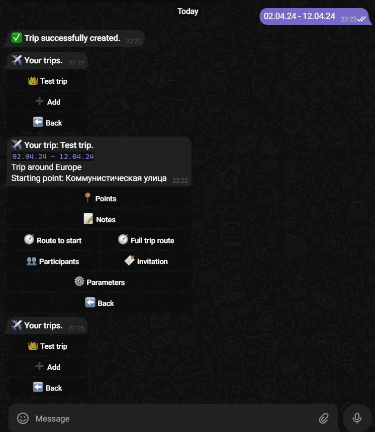
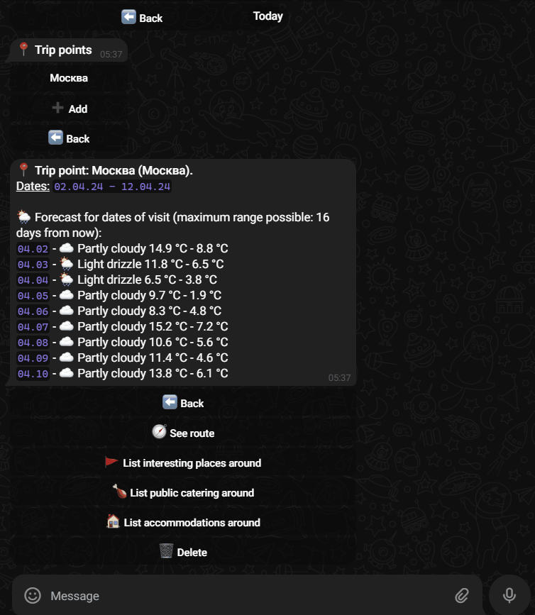
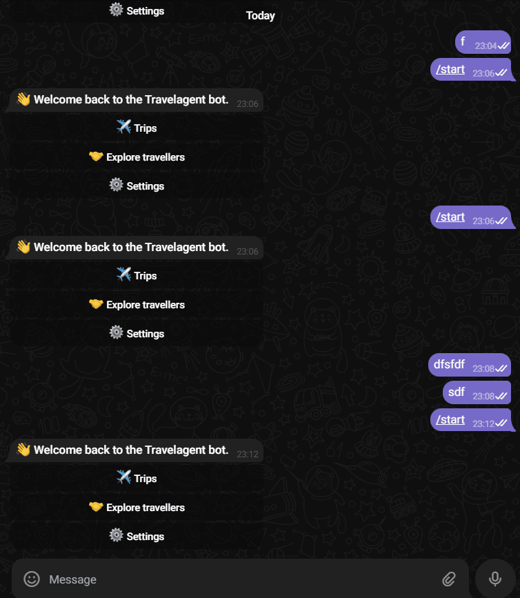

# Travelagent bot
Telegram `@tl_travelargent_bot`

Данный бот позволяет удобно планировать свои путешествия.

## Оглавление
<!-- TOC -->
* [Travelagent bot](#travelagent-bot)
  * [Оглавление](#оглавление)
  * [Запуск](#запуск)
  * [Функциональность](#функциональность)
    * [Регистрация](#регистрация)
    * [Изменение данных в аккаунте и удаление аккаунта](#изменение-данных-в-аккаунте-и-удаление-аккаунта)
    * [Создание и редактирование путешествий](#создание-и-редактирование-путешествий)
    * [Добавление точек](#добавление-точек)
    * [Просмотр точки](#просмотр-точки)
    * [Построение маршрута путешествия](#построение-маршрута-путешествия)
    * [Заметки к путешествию](#заметки-к-путешествию)
    * [Управление пользователями в путешествии](#управление-пользователями-в-путешествии)
    * [Поиск пользователей для совместного путешествия](#поиск-пользователей-для-совместного-путешествия)
    * [Общие траты в путешествии](#общие-траты-в-путешествии)
  * [Используемые API](#используемые-api)
  * [Схема БД](#схема-бд)
<!-- TOC -->

## Запуск

> Требование: наличие docker, docker compose

Для запуска достаточно:
1. Склонировать этот репозиторий
2. Перейти в папку с файлом docker-compose.yml
3. Выполнить `docker compose build`, `docker compose up -d`

## Функциональность
(сопровождается гифками)

### Регистрация
При первом взаимодействии, начнется процесс регистрации. Необходимо указать
город, возраст, пол, интересы и "о себе" (опционально).

### Изменение данных в аккаунте и удаление аккаунта
В главном меню через кнопку `Settings` открывается профиль, где можно изменить
его и удалить.

### Создание и редактирование путешествий
С помощью кнопки `Trips` в главном меню заходим в список путешествий. Для
добавления нажимаем кнопку `Add`. Указываем информацию о путешествии. После
создания попадаем снова в список где видим созданное путешествие. Корона
рядом с названием говорит о том, что мы владельцы данного путешествия.

По клику на кнопку с путешествием заходим в него.

Редактирование и удаление путешествия аналогично профилю - заходим в 
`Parameters` и делаем то, что нужно.

### Добавление точек
В путешествии заходим в раздел `Points` и аналогичным образом добавляем точку
путешествия. Поддерживаются не только города, но и отдельные точки. Просто
пишем название и все. Если вдруг по указанному названию будет найдено
несколько объектов, нам будет предложено выбрать нужный.

### Просмотр точки
Нажав на нужную точку, можно посмотреть детали: Расположение, даты визита,
прогноз погоды на даты визита (прогноз максимум на 16 дней вперед от 
данного момента).

С помощью кнопки `See route` можно построить маршрут от предыдущей точки до
данной.

С помощью кнопки `List interesting places around` можно просмотреть список
достопримечательностей (со ссылками на их OpenStreetMap). Иконки справа
показывают, какого типа достопримечательность.
Аналогично, `List public catering around` показывает список точек питания, а
`List accommodations around` показывает отели и подобные заведения.

### Построение маршрута путешествия
В меню путешествия, нажав на кнопку `Route to start` можно построить маршрут
от вашего текущего города пребывания до стартовой точки маршрута.

По кнопке `Full trip route` можно посмотреть весь маршрут путешествия

> **Внимание!** 
> Из-за ограничений по построению маршрутов, их нельзя прокладывать там,
> где нет дорог (в т.ч. и через океан), а так же нельзя прокладывать их
> более чем на 6 тыс. км (особенно актуально для `Full trip route`)
> 
> Кроме того, построение маршрута может занять довольно много времени 
> (до 1.5 минут)

### Заметки к путешествию
Все заметки находятся в `Notes`. Создаем новую. Указываем название, а затем
контент: шлем сколько угодно каких угодно сообщений _(можно даже всякую
ерунду вроде опросов! - **уникальная возможность**)_ и когда закончим, 
нажимаем `Done`. Устанавливаем доступность заметки: публичная или приватная
и можем теперь ее просмотреть.

В меню просмотра заметки видим ее контент, настройки приватности и возможность
удалить.

> **Важно!**
> Из-за особенностей хранения контента заметок, не удаляйте сообщения из
> чата!

### Управление пользователями в путешествии
Чтобы добавить других пользователей в путешествие, необходимо
дать им команду-приглашение. Она находится в разделе `Invitation`. 
Там можно как скопировать текущее приглашение, так и его пересоздать.

Когда участник присоединяется, все другие участники получают об этом
уведомление.

Все участники путешествия появятся в списке `Participants`. Оттуда их
можно будет удалять.

> Ремарка: на демонстрации происходит добавление самого себя в путешествие.
> Сделано это исключительно ради быстрой демонстрации. В приложении такого
> бага/функционала нет.

### Поиск пользователей для совместного путешествия
В главном меню, в пункте `Explore travellers` можно подобрать пользователей 
для совместного путешествия на основе интересов. Реализована сортировка по
релевантности. По нажатии на кнопку с пользователем, можно послать ему
уведомление с каким-то текстом, чтобы "наладить с ним контакт".

Если вы не хотите, чтобы вы отображались в этом списке, можно установить
соответствующую настройку в профиле: `Do not display me in 'Explore'`

> **Внимание!** 
> Пользователи без юзернейма не поддерживаются!

> Ремарка: на демонстрации происходит выбор самого себя в качестве "друга".
> Сделано это исключительно ради быстрой демонстрации. В приложении такого
> бага/функционала нет.

### Общие траты в путешествии
В меню путешествия при нажатии на кнопку `Transactions`, появляется
меню трат. В подменю `My debts` можно увидеть все свои долги. В подменю
`My credits` можно увидеть всех задолжавших тебе. Как только долг
урегулируется, по нажатию на нужную кнопку долга в `My credits` долг
удаляется.

Для создания транзакции нажми на `Create new transaction`, в списке
выбери пользователей-должников и введи сумму (она разделится на всех).
После создания транзакции, всем должникам будет послано соотвествующее
уведомление.

> Ремарка: на демонстрации происходит выбор самого себя в качестве должника.
> Сделано это исключительно ради быстрой демонстрации. В приложении такого
> бага/функционала нет.

## Используемые API
- Для поиска локаций, reverse-geocoding и прочих подобных 
  операций используется [OpenStreetMap Nominatim API](https://nominatim.org/)
  ([nominatim.openstreetmap.org](https://nominatim.openstreetmap.org/))
  
  Причина выбора: Open-source, бесплатный

  Используемые API: Search, Reverse, Lookup

- Для построения маршрутов используется [OpenRouteService](https://openrouteservice.org/)
  
  Причина выбора: Open-source, бесплатный план с довольно 
  несущественными (на данном этапе) ограничениями

  Используемые API: Directions

- Для получения прогнозов погоды используется [Open-Meteo](https://open-meteo.com/)
  
  Причина выбора: Open-source, бесплатный

  Используемые API: Forecast

- Для получения данных о достопримечательностях используется [OpenTripMap](https://dev.opentripmap.org/)

  Причина выбора: Open-source, бесплатный план с довольно 
  несущественными (на данном этапе) ограничениями

  Используемые API: Places

## Схема БД
[Тык](https://dbdiagram.io/d/Travelagent-diagram-66008fbaae072629ced4dcaf)

Выбрана БД Postgresql, т.к. она быстрая и надежная
